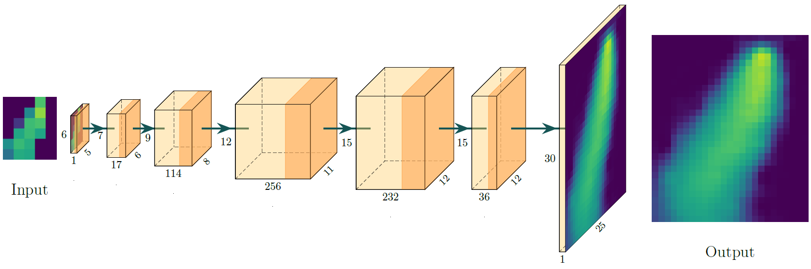

# Super-Resolution for Gas Distribution Mapping

## Introduction

This repository contains the code for our paper [**Super-resolution for Gas Distribution Mapping**](https://www.sciencedirect.com/science/article/pii/S0925400524009973), in which we provide:

1. Gas Distribution Decoder (GDD): A CNN-based **method for spatiotemporal interpolation** of spatially sparse sensor measurements.
2. An extensive **dataset of synthetic gas distribution maps based on actual airflow measurements**. As generating ground truth maps is nearly impossible, this dataset provides a valuable resource for researchers in this field. It is available online, along with the code for our neural network model. 
3. A detailed comparative evaluation of GDD with state-of-the-art models on synthesized and real gas distribution data.

## Usage
GDD and the implementations of the state-of-the-art models can be found in the folder "models". Pre-trained GDD models are saved as PyTorch *.pth files. Model parameters can be found in the associated *.yaml file.

Our datasets can be found in the folder "data". Each file contains the gas distribution maps in a Tensor object and can be loaded with torch.load(*file*). Additionally, you can use the specified PyTorch dataset and PyTorch Lightning datamodule to conveniently load samples. Their usage can be found in the different Jupyter notebook files (*.ipynb).

## License
This software is released under the MIT license. See the [LICENSE](LICENSE.md) file for more details.

## Acknowledgements
This research was funded by BAM, SAF€RA (project RASEM) and JSPS (KAKENHI 474 Grant Number 22H04952 and 22K12124).

- The GMRF implementation is heavily based on the [MAPIRlab's implementation](https://github.com/MAPIRlab/gdm)
- The Kernel DM+V implementation is heavily based on the [Stephan Müller's implementation](https://gitlab.com/smueller18/TDKernelDMVW)

## Contact Information
Please contact us either via Github or via mro[at]bam.de

If you find this code useful, please cite our paper:
```
@article{winkler2024super,
  title = {Super-resolution for Gas Distribution Mapping},
  journal = {Sensors and Actuators B: Chemical},
  volume = {419},
  pages = {136267},
  year = {2024},
  issn = {0925-4005},
  doi = {https://doi.org/10.1016/j.snb.2024.136267},
  url = {https://www.sciencedirect.com/science/article/pii/S0925400524009973},
  author = {Nicolas P. Winkler and Oleksandr Kotlyar and Erik Schaffernicht and Haruka Matsukura and Hiroshi Ishida and Patrick P. Neumann and Achim J. Lilienthal},
}
```
